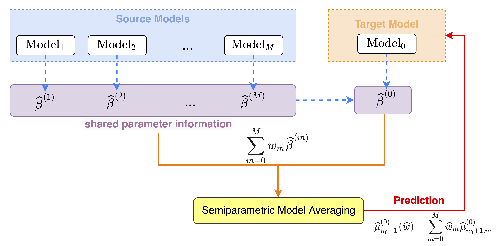

---
output:
  pdf_document: default
  html_document: default
---
<a id="top"></a>

---
title: "matrans-vignette"
author: "Xiaonan Hu"
date: "`r Sys.Date()`"
header-includes:
   - \usepackage{dsfont}
   - \usepackage{bm}
   - \usepackage[mathscr]{eucal}
output: rmarkdown::html_vignette
vignette: >
  %\VignetteIndexEntry{matrans-vignette}
  %\VignetteEngine{knitr::rmarkdown}
  %\VignetteEncoding{UTF-8}
---

```{r, include = FALSE}
knitr::opts_chunk$set(
  collapse = TRUE,
  comment = "#>"
)
```

In order to integrate auxiliary information from multiple sources and improve the prediction performance of the target model of interest, we propose a novel transfer learning framework based on frequentist model averaging strategy, and provide the implementation of relevant algorithms in this package. In this explanatory document, we will introduce the model settings and our algorithm in detail, and illustrate the usage of the functions in the package. The document is summarized as follows:
 
* [Model frameworks](#model)

  + [Partially linear models](#plm)

* [Transfer learning via frequentist model averaging](#ma)
  
  + [Trans-SMAP](#transsmap)
  
* [Implementation](#implement)

* [Examples](#example)

  + [Data preparation](#data)

  + [Model fitting and prediction](#fitting)


```{r, echo = FALSE}
library(formatR)
```

# Model frameworks{#model}

## Partially linear models{#plm}

Suppose we have the \emph{target} data $\{y_i^{(0)}, \bm{x}_i^{(0)}, \bm{z}_i^{(0)}\}$ for $i=1,\ldots,n_0$ and \emph{source} data $\{y_i^{(m)}, \bm{x}_i^{(m)}, \bm{z}_i^{(m)}\}$ for  $m=1,\ldots,M$, $i=1,\ldots,n_m$. For the $m$th data set, $y_i^{(m)}$ are continuous scalar responses, $\bm{x}_i^{(m)}=(x_{i1}^{(m)},\ldots,x_{ip}^{(m)})^T$ and $\bm{z}_i^{(m)}=(z_{i1}^{(m)},\ldots,z_{iq_m}^{(m)})^T$ are $p$-dimensional and $q_m$-dimensional observations, respectively. Suppose that the target and source samples follow $M+1$ partially additive linear models as 
$$
  y_i^{(m)}=\mu_i^{(m)}+\varepsilon_i^{(m)}=(\bm{x}_i^{(m)})^{T}\bm\beta^{(m)}+g^{(m)}(\bm z_i^{(m)})+\varepsilon_i^{(m)},
$$
where $g_l^{(m)}$ is a one-dimensional unknown smooth function, and $\varepsilon_i^{(m)}$ are independent random errors with $E(\varepsilon_i^{(m)}\lvert\bm{x}_i^{(m)},\bm{z}_i^{(m)})=0$ and $E\{(\varepsilon_i^{(m)})^2\lvert\bm{x}_i^{(m)},\bm{z}_i^{(m)}\}=\sigma_{i,m}^2$. Here $\bm\beta^{(m)}$ in different source models are allowed to be identical or different from the target model, which means source models possibly share parameter information with the target model. To estimate multiple semiparametric models, a polynomial spline-based estimator is adopted to approximate nonparametric functions. Assume that there exists a normalized B-spline basis $B_l^{(m)}(z)=\{b_{l1}(z),\ldots,b_{lv_l^{(m)}}(z)\}^T$ of the spline space, then the estimator can be transformed into a least squares formula.


# Transfer learning via frequentist model averaging{#ma}

## Trans-SMAP{#transsmap}

First, we construct $M+1$ partially linear models for different sources, and define the estimators of $\mu_{i}^{(0)}$ corresponding to the $M+1$ models by
$$
\widehat{\mu}_{i,m}^{(0)}=(\bm d_{i}^{(0)})^T\widehat{\bm\theta}_m^{(0)}=\left\{
\begin{aligned}
(\bm{x}_{i}^{(0)})^{T}\widehat{\bm\beta}^{(0)}+\sum_{l=1}^{q_0}\{B_l^{(0)}(z_{il}^{(0)})\}^T\widehat{\bm\gamma}_l^{(0)}& ,~~~m=0, \\
(\bm{x}_{i}^{(0)})^{T}\widehat{\bm\beta}^{(m)}+\sum_{l=1}^{q_0}\{B_l^{(0)}(z_{il}^{(0)})\}^T\widehat{\bm\gamma}_l^{(0)} & ,~~~m=1,\ldots,M,
\end{aligned}
\right.
$$
where $\widehat{\bm\theta}_m^{(0)}=\{(\widehat{\bm\beta}^{(m)})^T, (\widehat{\bm\gamma}_1^{(0)})^T,\ldots,(\widehat{\bm\gamma}_{q_0}^{(0)})^T\}^T$. 

Then, the final prediction is defined as $\widehat{\mu}_{i}^{(0)}(\bm w)=\sum_{m=0}^{M}w_m\widehat{\mu}_{i,m}^{(0)}$, where $\bm w=(w_0,\ldots,w_{M})^T$ is the weight vector in the space $\mathcal{W}=\{\bm w\in[0,1]^{M+1}:\sum_{m=0}^{M}w_m=1\}$. To estimate the weights, we adopt the following $J$-fold cross-validation based weight choice criterion
$$
  CV(\bm w)=\frac{1}{n_0}\sum_{j=1}^{J}\sum_{i\in\mathcal{G}_j}\left\{y_i^{(0)}-\widehat{\mu}_{i,[\mathcal{G}_j^c]}^{(0)}(\bm w)\right\}^2,
$$
where $\widehat{\mu}_{i,m,[\mathcal{G}_j^c]}^{(0)}$ is similar to $\widehat{\mu}_{i,m}^{(0)}$ except that the estimator is based on data corresponding to the subgroup $\mathcal{G}_j^{c}$. The optimal weights are obtained by solving the constrained optimization problem
$$
  \widehat{\bm w}=\arg\min\limits_{\bm w\in\mathcal{W}}CV(\bm w).
$$

The flowchart of the Trans-SMAP is shown as follows.

{width=80%}


# Implementation{#implement}

To implement the estimation of semiparametric models, we apply the cubic B-splines in package `splines`. The hyperparameters in B-splines can be specified through the argument `bs.para` in the R functions `trans.smap` and `pred.transsmap`. The optimization of weights can be formulated as a constrained quadratic programming problem, which can be implemented by the function `solve.QP` in package `quadprog`.

You can install the `matrans` package with the following codes:
``` {r, eval=FALSE}
library("devtools")
devtools::install_github("XnhuUcas/matrans")
```
or
``` {r, eval=FALSE}
install.packages("matrans")
```
Then you can load the package
```{r}
library(matrans)
```


# Examples{#example}

## Data preparation{#data}

First, we generate simulation datasets with the same settings for $M=3$ as Section 4.1 in Hu and Zhang (2023) through the function `simdata.gen`.

```{r, tidy=TRUE, tidy.opts=list(width.cutoff=70)}
set.seed(1)
## sample size
size <- c(150, 200, 200, 150)
## shared coefficient vectors for different models
coeff0 <- cbind(
  as.matrix(c(1.4, -1.2, 1, -0.8, 0.65, 0.3)),
  as.matrix(c(1.4, -1.2, 1, -0.8, 0.65, 0.3) + 0.02),
  as.matrix(c(1.4, -1.2, 1, -0.8, 0.65, 0.3) + 0.3),
  as.matrix(c(1.4, -1.2, 1, -0.8, 0.65, 0.3))
)
## dimension of parametric component for all models
px <- 6
## standard deviation for random errors
err.sigma <- 0.5
## the correlation coefficient for covariates
rho <- 0.5
## sample size for testing data
size.test <- 500

whole.data <- simdata.gen(
  px = px, num.source = 4, size = size, coeff0 = coeff0, coeff.mis = as.matrix(c(coeff0[, 2], 1.8)),
  err.sigma = err.sigma, rho = rho, size.test = size.test, sim.set = "homo", tar.spec = "cor",
  if.heter = FALSE
)
## multi-source training datasets
data.train <- whole.data$data.train
## testing target dataset
data.test <- whole.data$data.test
```

## Model fitting and prediction{#fitting}

Second, we apply the function `trans.smap` to estimate the candidate models and model averaging weights based on the training data.

```{r, tidy=TRUE, tidy.opts=list(width.cutoff=70), collapse=FALSE, comment='', warning=FALSE}
## hyperparameters for B-splines
bs.para <- list(bs.df = rep(3, 3), bs.degree = rep(3, 3))
## the second model is misspecified
data.train$data.x[[2]] <- data.train$data.x[[2]][, -7]
## fitting the Trans-SMAP
fit.transsmap <- trans.smap(train.data = data.train, nfold = 5, bs.para = bs.para)
## weight estimates
fit.transsmap$weight.est
## computational time of algorithm (sec)
fit.transsmap$time.transsmap
```

Finally, we apply the function `pred.transsmap` to make predictions on new data from the target model based on the fitting models.
```{r, tidy=TRUE, tidy.opts=list(width.cutoff=70), collapse=FALSE, comment='', warning=FALSE}
## prediction using testing data
pred.res <- pred.transsmap(object = fit.transsmap, newdata = data.test, bs.para = bs.para)
## predicted values for the new observations of predictors
pred.val <- pred.res$predict.val
## mean squared prediction risk for Trans-SMAP
sum((pred.val - data.test$data.x %*% data.test$beta.true - data.test$gz.te)^2) / 500
```


# References

* Hu, X., & Zhang, X. (2023). [Optimal Parameter-Transfer Learning by Semiparametric Model Averaging](http://jmlr.org/papers/v24/23-0030.html). *Journal of Machine Learning Research*, 24(358), 1-53. 


